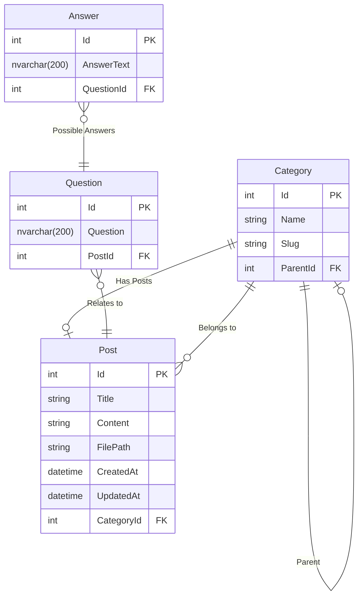

## Tobiso.Web Database Documentation

### Entities

#### Category
- `Id` (int, PK)
- `Name` (nvarchar(128), required)
- `Slug` (nvarchar(128), required)
- `ParentId` (int, FK, nullable) → references `Category(Id)`
- `Children` (List<Category>)

#### Post
- `Id` (int, PK)
- `Title` (nvarchar, required)
- `Content` (nvarchar, required)
- `FilePath` (nvarchar, required)
- `CreatedAt` (datetime2, required)
- `UpdatedAt` (datetime2, nullable)
- `CategoryId` (int, FK, nullable) → references `Category(Id)`

### Relationships
- Category has self-referencing parent/child relationship.
- Post optionally belongs to a Category.

---

### Mermaid ER Diagram



---

### SQL for New Tables

```sql
CREATE TABLE [Questions] (
	[Id] INT PRIMARY KEY IDENTITY(1,1),
	[Question] NVARCHAR(200) NOT NULL,
	[PostId] INT NOT NULL,
	FOREIGN KEY ([PostId]) REFERENCES [Post]([Id])
);

CREATE TABLE [Answers] (
	[Id] INT PRIMARY KEY IDENTITY(1,1),
	[AnswerText] NVARCHAR(200) NOT NULL,
	[QuestionId] INT NOT NULL,
	FOREIGN KEY ([QuestionId]) REFERENCES [Questions]([Id])
);
```
